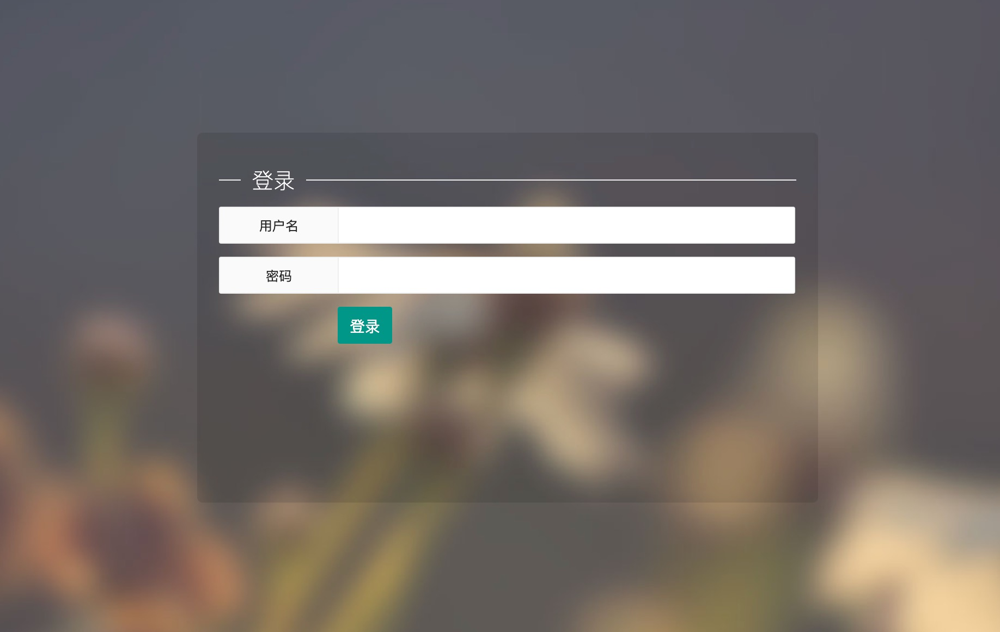
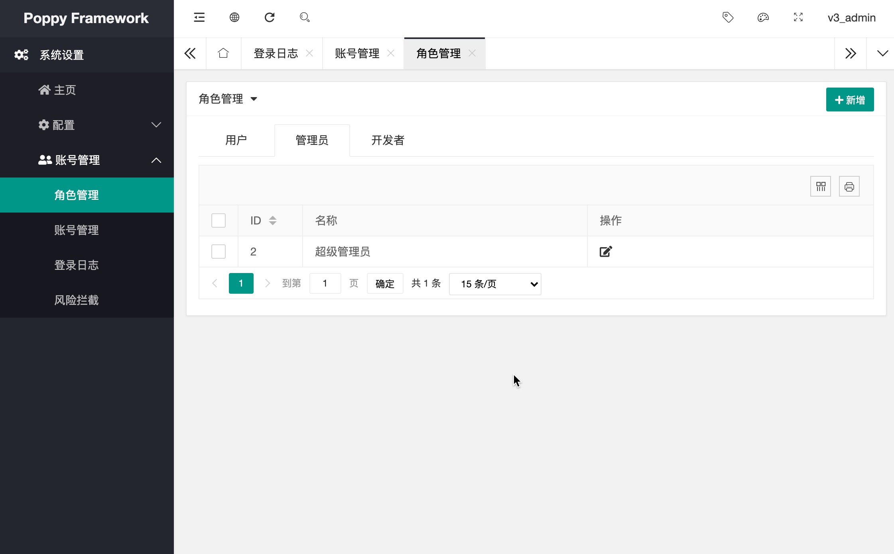
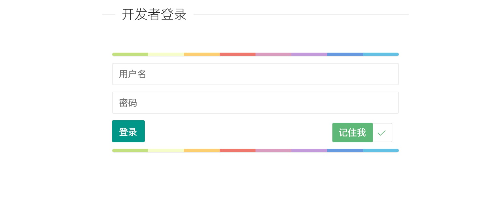
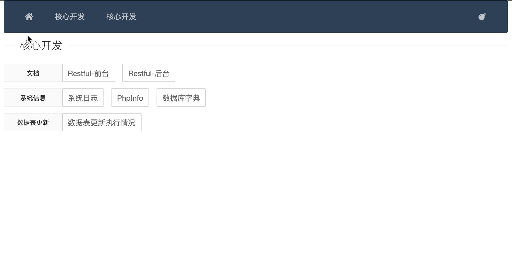

# 说明

本项目是基于 Laravel 6.0 LTS 的模块化开发框架, 项目为了便于管理分为 框架, 核心, 管理, 组件, 使用 composer 进行模块化安装

- 项目文档 : https://poppy.wulicode.com/doc/
- V3 Demo : https://v3.wulicode.com

## 介绍

使用本项目可以快速的完成项目业务逻辑的开发, 其中包含

- RBAC权限管理
- 完整的后台管理框架
- 用户管理
- 接口验签
- 接口开发工具
- 快速表单生成

项目是在公司内部的业务逻辑的基础之上剥离出来, 并且应用在公司快速开发的项目中, 内涵丰富的功能，可满足日常 80% 的开发需求

## 安装

**初始化项目并启动服务**

```
# install
$ composer create-project poppy/project poppy_v3 ^3.1

# Internal install
$ composer create-project poppy/project poppy_v3 ^3.1 --repository=https://packagist.sour-lemon.com

# Start service server
$ cd poppy_v3
$ php artisan serve
Laravel development server started: <http://127.0.0.1:8000>
[Sun Sep 19 17:19:52 2021] PHP 7.4.23 Development Server (http://127.0.0.1:8000) started
```

**创建 test 模块**

```
# 快速创建模块
$ php artisan poppy:make test -Q
```

> 因为默认框架中不包含 `/` 主页访问, 所以访问主页会报 404 错误码

```
# test web request
$ curl http://127.0.0.1:8000/test

# test api request
Test Web Request Success
$ curl http://127.0.0.1:8000/api/test
Test Api Request Success

# test backend request
$ curl 127.0.0.1:8000/mgr-page/test
> 302 response
> to login url ...
```

## 安装数据库及用户

**创建数据库**

在初始化数据库之前需要先创建一个空数据库, 数据库类型为 `utf8mb4_general_ci`, 可以保证 emoji 类型的数据正常存储, 这里我定义名字为 `poppy_v3`

在 `.env` 文件中配置账号和密码

```
# Database Config
# ------------------------------------
DB_HOST=127.0.0.1
DB_DATABASE=poppy_v3
DB_USERNAME=duoli
DB_PASSWORD=null
```

**执行 migrate**

```
$ php artisan poppy:migrate
Migration table created successfully.
Migrating: 2018_02_27_144933_create_pam_account_table
Migrated:  2018_02_27_144933_create_pam_account_table (0.05 seconds)
...
```

**执行安装**

```
$ php artisan py-system:install
Start Install Lemon Framework!
Init UserRole Ing...
Init Role success
Install User Roles Success
Init Rbac Permission...
(poppy.core.PermissionCommand) Import permission Success! 
Init Rbac Permission Success
```

**创建用户**

创建管理员

```
$ php artisan py-system:user create_user

 Please input passport!:
 > v3_admin

 Please input password!:
 > v3_admin

 Please input role name!:
 > root

User v3_admin created
```

创建开发者

```
$ php artisan py-system:user create_user

 Please input passport!:
 > v3_develop

 Please input password!:
 > v3_develop

 Please input role name!:
 > develop

User v3_develop created
```
## 登录

**登录后台**

http://127.0.0.1:8000/mgr-page





**登录开发平台**

http://127.0.0.1:8000/mgr-page/develop






## 反馈

[Github Issues](https://github.com/imvkmark/poppy-project/issues)
